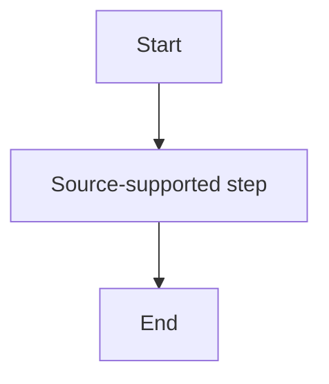

# 40 - Generate Customer-Facing Functional Design

## Purpose

Generate an English customer-facing Functional Design (FD) draft from the approved internal requirement evidence and review artifacts.

The FD must read like a normal customer review document derived from the provided BRD/source content. It must not expose the internal extraction pipeline, internal artifact names, internal IDs, prompt names, AI/Copilot usage, or analysis workflow.

This task generates an FD draft only. It does not generate Detailed Design, coding design, implementation tasks, test cases, or customer Q&A responses.

## Operating rules

- Use only the source artifacts listed in this prompt.
- Do not invent requirements, field meanings, business rules, messages, screen behavior, command behavior, API behavior, diagrams, or implementation design.
- Preserve source-specific terms unless `output/11_translation_policy.md` or `output/21_glossary.md` defines a controlled English rendering.
- Preserve exact spelling for acronyms, field names, product-specific terms, operation names, command names, option names, parameters, and code-like identifiers.
- Mark ambiguous, missing, or conflicting information as `TBD` or `Requires confirmation` instead of guessing.
- Preserve source-supported negative statements, unsupported cases, constraints, exceptions, notes, and footnotes when they affect behavior.
- Respect strikethrough handling from the pipeline:
  - Strikethrough-only content is inactive / deleted / deprecated / superseded evidence by default.
  - Do not include strikethrough-only content as active FD behavior, active rule, active flow, active command behavior, or active supported operation unless the source explicitly says otherwise.
  - If strikethrough content conflicts with active evidence and the conflict affects FD behavior, include it only as an open question or confirmation point.
- Treat image-derived behavior carefully:
  - Use image evidence only when it is analyzed in `output/20_image_analysis.md` and supported by text/rules, or clearly marked as diagram-derived.
  - Do not overstate figure-only interpretation as text-confirmed behavior.
  - Do not add new confirmed FD behavior from manual pasted evidence unless it is also supported by `output/30_requirement_inventory.md`, `output/31_business_rule_catalog.md`, or `output/12_normalized_evidence.md`.
- Write the output in professional English suitable for customer review.
- Keep customer-facing content free from internal IDs and internal pipeline terms.

## Tasks

### Precondition

Use the latest effective gates before generating the FD.

#### Translation gate

- If `output/15_translation_review_followup_report.md` exists, use it as the latest translation gate.
- Otherwise, use `output/13_translation_review_report.md`.
- Continue only if the latest translation gate is `Go` or `Go with warnings`.
- Stop if the latest translation gate is `No-Go`.

#### Feature understanding gate

- Use `output/34_FEATURE_UNDERSTANDING_REVIEW.md` as the latest feature understanding gate.
- Continue only if the step 34 decision is `Go` or `Go with minor notes`.
- Stop if the step 34 decision is `Fix required` or `No-Go`.
- If step 34 has minor notes, address them when drafting the FD, but do not invent missing evidence.

### Instructions

Create a customer-facing FD draft by using the internal artifacts only as evidence and quality guardrails.

The FD must:

1. Explain the function objective and scope.
2. Describe source-supported functional behavior.
3. Preserve supported and unsupported operations.
4. Preserve business rules, constraints, validations, state conditions, exceptions, and notes.
5. Include input/output data only when source-supported.
6. Include error/warning/unsupported handling only when source-supported.
7. Include diagrams or extracted images only when they are relevant, readable, and source-supported.
8. Include customer-facing open questions when source evidence is unclear, missing, conflicting, figure-only, or requires confirmation.
9. Avoid internal evidence identifiers in the customer-facing FD.
10. Keep implementation, DD, code, test strategy, and architecture decisions out of the FD unless the source explicitly defines them as functional behavior.

## Inputs

### Primary inputs

- `output/34_FEATURE_UNDERSTANDING_REVIEW.md`
- `output/33_FEATURE_UNDERSTANDING_BRIEF.md`
- `output/30_requirement_inventory.md`
- `output/31_business_rule_catalog.md`
- `output/32_open_questions.md`
- `output/21_glossary.md`
- `output/20_image_analysis.md`
- `output/12_normalized_evidence.md`

### Gate and terminology inputs

- `output/13_translation_review_report.md`
- `output/15_translation_review_followup_report.md` if available
- `output/11_translation_policy.md`

### Optional supplemental input

Rules for optional supplemental input:

- Use it to check whether the FD should clarify wording, add an open question, or avoid missing a known source-supported detail.
- Do not use it as a standalone basis for new confirmed FD behavior.
- If it identifies a missing candidate not yet integrated into `30/31/32`, include it only as `Requires confirmation` or an open question unless it can be verified in `output/12_normalized_evidence.md`.

### Supporting inputs, open only when needed

- `output/10_document_inventory.md`
- `working/extracted/document_text.md`
- `working/extracted/tables.md`
- `working/extracted/image_inventory_raw.md`
- files under `working/extracted/images/`
- `working/extracted/formatting_inventory.md` if available

Use supporting inputs only for targeted verification, not as the main drafting source.

## Outputs

### Output file to create or update

Create or overwrite:

- `output/40_FD_DRAFT.md`

### Optional internal review output

Create only if requested or if needed for internal review:

- `output/40_FD_INTERNAL_TRACEABILITY.md`

The customer-facing FD must not include internal traceability details.

## Required output quality

- The FD must be customer-facing.
- Do not expose internal artifact names, internal IDs, prompt names, file names, pipeline steps, AI/Copilot usage, or analysis workflow.
- Do not include `REQ-xxx`, `BR-xxx`, `TERM-xxx`, `OQ-xxx`, `FIG-xxx`, `TRACE-xxx`, or similar internal IDs in the FD body.
- Use clean FD section numbering and customer-friendly labels.
- Use concise technical English.
- Use `TBD` when a detail is required for the FD but missing from the source.
- Use `Requires confirmation` when meaning is uncertain or evidence conflicts.
- Preserve exact command/option/parameter spelling where relevant.
- Do not include visuals only for decoration.
- Do not generate a traceability matrix inside the customer-facing FD.

## Required FD structure

Write `output/40_FD_DRAFT.md` using this structure:

```markdown
# Functional Design

## 1. Overview

Describe the business/function objective based on the source document.

## 2. Scope

Describe what this Functional Design covers.

### 2.1 In Scope

List source-supported in-scope functions, operations, screens, APIs, commands, data, scenarios, or behavior.

### 2.2 Out of Scope / Unsupported

List explicitly unsupported or excluded behavior.

If the source does not clearly define out-of-scope items, write:

`TBD - Not explicitly defined in the source document.`

## 3. Terminology

List important terms used in the FD.

| Term | Meaning / Usage | Note |
|---|---|---|

Rules:

- Use controlled terminology from the glossary and translation policy.
- Preserve acronyms, field names, operation identifiers, command names, option names, parameters, and product-specific terms when required.
- Do not expose glossary IDs.
- If a term is uncertain, mark it as `Requires confirmation`.

## 4. Business / Operation Summary

Summarize the business or technical operation described by the source.

Rules:

- Keep the summary concise.
- Do not add background knowledge not found in source evidence.
- Include diagram-supported operation/time/state behavior only when source-supported.

## 5. Functional Behavior

Describe each major function or operation.

### 5.x <Function / Operation Name>

Include the following subsections where source-supported:

#### Purpose

#### Trigger

#### Preconditions

#### Main Behavior

#### Alternative / Exception Behavior

#### Unsupported Behavior

#### Notes

Rules:

- Preserve source-supported conditions and constraints.
- Preserve unsupported cases and negative statements.
- Do not convert assumptions into confirmed behavior.
- Do not expose internal requirement/rule IDs.

## 6. Business Rules and Constraints

Describe business rules, operation constraints, validation rules, naming rules, state constraints, data constraints, and unsupported cases.

| No. | Rule / Constraint | Condition | Expected Behavior | Notes |
|---|---|---|---|---|

Rules:

- Preserve exact mandatory/optional meaning.
- Preserve exceptions, notes, and footnotes.
- If a rule is uncertain, mark it as `Requires confirmation`.

## 7. Command / API / Operation Specification

Include this section when the source defines command syntax, API behavior, operation options, parameters, or supported/unsupported operation combinations.

| Operation | Command / API / Function | Required Parameters / Options | Optional Parameters / Options | Supported? | Notes |
|---|---|---|---|---|---|

Rules:

- Preserve exact command names, options, parameters, and values.
- Do not invent parameters.
- Do not normalize away symbols such as hyphens, underscores, angle-bracket placeholders, or option prefixes.
- If syntax is partial or uncertain, mark it as `Requires confirmation`.

## 8. Visual Overview and Scenario Diagrams

Include this section only when source diagrams, extracted images, or source-supported Mermaid diagrams help explain the FD.

### 8.x <Scenario / Diagram Name>

Source diagram, if included:


Derived workflow, if helpful and source-supported:



Rules:

- Use original extracted image paths when including source images.
- Do not recreate or alter an available original image.
- Do not include unreadable, duplicate, or irrelevant images.
- Mermaid diagrams must be simple and based only on source-supported behavior.
- Phrase figure-only behavior carefully as diagram-indicated behavior.

## 9. Time-Based / Scenario Flows

Include this section only if the source describes time-based behavior, retention behavior, sequence behavior, scheduling, lifecycle behavior, or state changes over time.

| Step | Timing / Event | State / Operation | Result | Notes |
|---|---|---|---|---|

Rules:

- Use only behavior supported by text, tables, notes, footnotes, or diagrams.
- Do not overstate diagram-only behavior as text-confirmed.

## 10. Input / Output Data

Describe input and output data if supported by the source.

| Data Item | Direction | Description | Required? | Notes |
|---|---|---|---|---|

Rules:

- Preserve exact field names and identifiers.
- Do not invent data items.
- Use `TBD` for missing required details.

## 11. Error / Warning / Unsupported Handling

Describe error handling, warning handling, unsupported operations, guard behavior, and expected results when conditions are not satisfied.

| Case | Condition | Handling | Message / Result | Notes |
|---|---|---|---|---|

Rules:

- If exact message IDs or message text are not defined, write `TBD`.
- Do not invent messages.

## 12. Data Mapping / Naming / Identifier Rules

Include this section only if the source defines field mapping, identifier composition, naming rules, data derivation rules, or display rules.

| Item | Rule | Source / Component | Notes |
|---|---|---|---|

Rules:

- Preserve exact spelling for field names, identifiers, and derived values.
- Do not invent derivation logic.

## 13. Assumptions

Only include assumptions that are necessary to make the FD readable.

| No. | Assumption | Impact |
|---|---|---|

Rules:

- Do not present assumptions as confirmed behavior.
- If an assumption affects behavior, also list it as an open question.

## 14. Open Questions

List unresolved items that require customer or domain expert confirmation.

| No. | Question | Reason / Impact |
|---|---|---|

Rules:

- Do not expose internal open-question IDs.
- Include terminology, behavior, diagram ambiguity, missing details, conflict, and visual ambiguity that affect the FD.

## 15. Source Notes

Use this customer-facing wording or equivalent:

`This Functional Design draft is based on the provided source document content, including text, tables, notes, footnotes, and embedded diagrams. Items not explicitly defined in the source are marked as TBD or Open Question.`
```

## Internal evidence handling rules

Use internal artifacts only to ensure FD quality and coverage.

- Use `output/30_requirement_inventory.md` to ensure requirement coverage.
- Use `output/31_business_rule_catalog.md` to ensure rule/constraint coverage.
- Use `output/32_open_questions.md` to populate customer-facing open questions.
- Use `output/21_glossary.md` to control terminology.
- Use `output/20_image_analysis.md` to include diagram-supported behavior and source image paths.
- Use `output/12_normalized_evidence.md` to preserve source meaning and verify suspicious or missing details.
- Use `output/33_FEATURE_UNDERSTANDING_BRIEF.md` to improve readability and organization.
- Use `output/34_FEATURE_UNDERSTANDING_REVIEW.md` to avoid known quality issues.

Do not expose these files, internal IDs, or internal workflow names in the FD.

## Optional internal traceability output

If creating `output/40_FD_INTERNAL_TRACEABILITY.md`, use this structure:

```markdown
# FD Internal Traceability

| FD Section | FD Statement / Topic | Related Requirement ID | Related Rule ID | Related Term ID | Related Open Question ID | Source Reference | Evidence Type | Confidence | Meaning Risk |
|---|---|---|---|---|---|---|---|---|---|
```

This file is internal only and must not be copied into the customer-facing FD.

## Quality checklist before finishing

Before finalizing `output/40_FD_DRAFT.md`, verify:

- No internal artifact names are mentioned.
- No internal IDs are exposed.
- No prompt, AI, Copilot, or pipeline terminology is exposed.
- Every FD behavior is supported by source evidence.
- Every included image is relevant, readable enough, and source-supported.
- Every Mermaid diagram is source-supported.
- Unsupported cases are preserved.
- Negative statements are preserved.
- Conditions and exceptions are preserved.
- Notes and footnotes that affect behavior are preserved.
- Strikethrough-only content is not treated as active behavior.
- Figure-only behavior is not overstated as text-confirmed behavior.
- Manual pasted evidence, if used, is not treated as standalone confirmed behavior.
- Uncertain items are marked as `TBD` or `Requires confirmation`.
- The FD reads like a clean customer-facing document derived from the original source document.

## Stop conditions

- Stop and report `No-Go` if required primary inputs are missing.
- Stop and report `No-Go` if the latest translation gate is `No-Go`.
- Stop and report `No-Go` if the step 34 feature understanding review decision is `Fix required` or `No-Go`.
- Stop and report `No-Go` if generating the FD would require unsupported assumptions.
- Do not continue to DD, coding design, or testing from this prompt.
