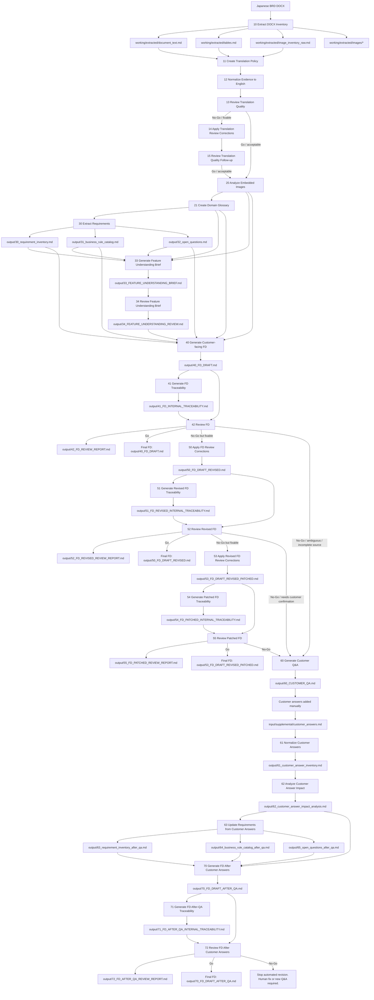
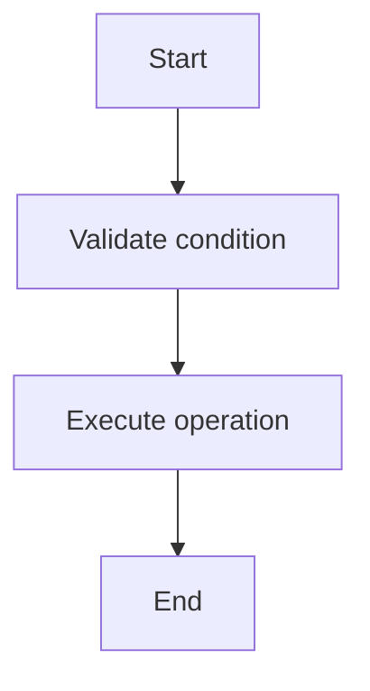

# Japanese BRD to English FD Copilot Workflow

A controlled GitHub Copilot workflow for converting Japanese DOCX Business Requirement Documents into English Functional Design drafts.

This workflow is designed for Japanese requirement documents that may contain:

- Japanese text
- tables
- notes and footnotes
- embedded images
- embedded diagrams
- technical screenshots
- source ambiguity or incomplete business descriptions

The workflow does **not** attempt to convert a BRD directly into an FD in one step. Instead, it uses evidence extraction, terminology control, image analysis, requirement extraction, traceability, and quality gates to reduce hallucination risk.

---

## Purpose

The purpose of this repository is to provide a reusable Copilot workflow template for:

```text
Japanese DOCX BRD
  → evidence extraction
  → English normalization
  → terminology control
  → image / diagram analysis
  → requirement inventory
  → business rule catalog
  → feature understanding brief for BA/developer onboarding
  → customer-facing English FD
  → internal traceability
  → review report
```

The final customer-facing FD should look like a normal Functional Design document. It must not expose internal prompt artifacts, internal IDs, or analysis pipeline details.

---

## What This Workflow Is

This is a **semi-automated Copilot workflow**.

It uses:

- GitHub Copilot Chat prompt files
- repository-level Copilot instructions
- Python-based DOCX extraction
- Markdown intermediate artifacts
- human review gates
- traceability and review reports

It is suitable for team experimentation and practical requirement analysis support.

---

## What This Workflow Is Not

This is **not** a fully automatic one-click BRD-to-FD converter.

Do not use this workflow as a replacement for:

- BA review
- SA review
- domain expert confirmation
- customer clarification
- human approval before delivery

If the source BRD is ambiguous, contradictory, or incomplete, the workflow should produce Q&A items instead of inventing business behavior.

---

## Repository Structure

```text
brd-to-fd-copilot-agent/
  README.md
  RUNBOOK.md

  .github/
    copilot-instructions.md
    prompts/
      10_extract_docx_inventory.prompt.md
      11_create_translation_policy.prompt.md
      12_normalize_evidence_to_english.prompt.md
      13_review_translation_quality.prompt.md
      14_apply_translation_review_corrections.prompt.md
      15_review_translation_quality_followup.prompt.md

      20_analyze_embedded_images.prompt.md
      21_create_domain_glossary.prompt.md

      30_extract_requirements.prompt.md

      33_generate_feature_understanding_brief.prompt.md
      34_review_feature_understanding_brief.prompt.md

      40_generate_customer_fd.prompt.md
      41_generate_fd_traceability.prompt.md
      42_review_fd.prompt.md

      50_apply_fd_review_corrections.prompt.md
      51_generate_revised_fd_traceability.prompt.md
      52_review_revised_fd.prompt.md

      53_apply_revised_fd_review_corrections.prompt.md
      54_generate_patched_fd_traceability.prompt.md
      55_review_patched_fd.prompt.md

      60_generate_customer_qa.prompt.md
      61_normalize_customer_answers.prompt.md
      62_analyze_customer_answer_impact.prompt.md
      63_update_requirements_from_customer_answers.prompt.md

      70_generate_fd_after_customer_answers.prompt.md
      71_generate_fd_after_customer_answers_traceability.prompt.md
      72_review_fd_after_customer_answers.prompt.md

  input/
    original/
      requirement.docx
    supplemental/
      customer_answers.md

  working/
    extracted/
      document_text.md
      tables.md
      image_inventory_raw.md
      images/

  output/
    10_document_inventory.md
    11_term_translation_policy.md
    12_document_inventory_english.md
    13_translation_quality_review.md
    13_translation_quality_review_followup.md

    20_image_analysis.md
    21_glossary.md

    30_requirement_inventory.md
    31_business_rule_catalog.md
    32_open_questions.md

    33_FEATURE_UNDERSTANDING_BRIEF.md
    34_FEATURE_UNDERSTANDING_REVIEW.md

    40_FD_DRAFT.md
    41_FD_INTERNAL_TRACEABILITY.md
    42_FD_REVIEW_REPORT.md

    50_FD_DRAFT_REVISED.md
    51_FD_REVISED_INTERNAL_TRACEABILITY.md
    52_FD_REVISED_REVIEW_REPORT.md

    53_FD_DRAFT_REVISED_PATCHED.md
    54_FD_PATCHED_INTERNAL_TRACEABILITY.md
    55_FD_PATCHED_REVIEW_REPORT.md

    60_CUSTOMER_QA.md
    61_customer_answer_inventory.md
    62_customer_answer_impact_analysis.md
    63_requirement_inventory_after_qa.md
    64_business_rule_catalog_after_qa.md
    65_open_questions_after_qa.md

    70_FD_DRAFT_AFTER_QA.md
    71_FD_AFTER_QA_INTERNAL_TRACEABILITY.md
    72_FD_AFTER_QA_REVIEW_REPORT.md

  tools/
    extract_docx.py
    check_outputs.sh
    reset_workspace.sh
```

---

## Main Workflow

### Happy Path

```text
Extract DOCX
  ↓
10 Extract document inventory
11 Create translation policy
12 Normalize evidence to English
13 Review translation quality
  ↓
20 Analyze embedded images
21 Create domain glossary
30 Extract requirements / rules / open questions
  ↓
33 Generate feature understanding brief
34 Review feature understanding brief
  ↓
40 Generate customer-facing FD
41 Generate FD traceability
42 Review FD
  ↓
Done if 42 = Go
```

Final customer-facing output:

```text
output/40_FD_DRAFT.md
```

Internal BA/developer understanding outputs:

```text
output/33_FEATURE_UNDERSTANDING_BRIEF.md
output/34_FEATURE_UNDERSTANDING_REVIEW.md
```

---

## Feature Understanding Brief Path

This branch is used to help BA/developers quickly understand the feature before reading the full FD or moving toward DD/coding design.

```text
30 Extract requirements / rules / open questions
  ↓
33 Generate feature understanding brief
34 Review feature understanding brief
  ↓
40 Generate customer-facing FD
```

The feature understanding brief is an internal artifact. It may be written in Vietnamese for local team onboarding, while the customer-facing FD should remain English unless the project explicitly requires another language.

The brief should explain:

- what the feature does
- who uses it
- the main business flow
- key inputs and outputs
- important business rules
- data touched by the flow
- open questions and ambiguity
- developer notes before DD/coding

---

## Correction Path

If the first FD review is not good enough:

```text
42 Review FD
  ↓
50 Apply FD review corrections
51 Generate revised FD traceability
52 Review revised FD
```

Final customer-facing output if `52 = Go`:

```text
output/50_FD_DRAFT_REVISED.md
```

---

## Patched FD Path

If the revised FD still needs another correction pass:

```text
52 Review revised FD
  ↓
53 Apply revised FD review corrections
54 Generate patched FD traceability
55 Review patched FD
```

Final customer-facing output if `55 = Go`:

```text
output/53_FD_DRAFT_REVISED_PATCHED.md
```

If `55 = No-Go`, do not keep asking Copilot to revise automatically. Generate customer Q&A or fix the correct evidence layer manually.

---

## Customer Q&A Path

If the BRD is ambiguous or source evidence is insufficient:

```text
60 Generate customer Q&A
  ↓
Customer/domain expert answers
  ↓
61 Normalize customer answers
62 Analyze customer answer impact
63 Update requirements from customer answers
  ↓
70 Generate FD after customer answers
71 Generate FD after customer answers traceability
72 Review FD after customer answers
```

Final customer-facing output if `72 = Go`:

```text
output/70_FD_DRAFT_AFTER_QA.md
```

Customer answers are treated as **supplemental source evidence**. They do not modify the original BRD.

---

## Pipeline Diagram



This diagram intentionally excludes ad-hoc image explanation files such as `output/image_003_explanation.md`. Those files are side analyses for a specific diagram and are not part of the main pipeline.

---

## Quality Gates

The key quality gates are:

```text
13 Review translation quality
34 Review feature understanding brief
42 Review FD
52 Review revised FD
55 Review patched FD
72 Review FD after customer answers
```

Do not continue blindly when a gate returns `No-Go`.

---

## Decision Rules

### If `13 = No-Go`

Run:

```text
14 Apply translation review corrections
15 Review translation quality follow-up
```

Continue only if `15 = Go` or `Go with minor corrections`.

### If `34 = No-Go`

Fix the feature understanding brief before using it for BA/developer onboarding. Do not let unsupported assumptions from the brief influence the FD.

### If `42 = Go`

Use:

```text
output/40_FD_DRAFT.md
```

### If `42 = No-Go` due to fixable FD issues

Run:

```text
50 → 51 → 52
```

### If `52 = Go`

Use:

```text
output/50_FD_DRAFT_REVISED.md
```

### If `52 = No-Go` but still fixable

Run:

```text
53 → 54 → 55
```

### If `55 = Go`

Use:

```text
output/53_FD_DRAFT_REVISED_PATCHED.md
```

### If `55 = No-Go`

Stop automatic revision. Run:

```text
60_generate_customer_qa
```

or manually fix the correct evidence layer.

### If customer answers are received

Place answers here:

```text
input/supplemental/customer_answers.md
```

Then run:

```text
61 → 62 → 63 → 70 → 71 → 72
```

---

## Source Evidence Rules

The workflow separates evidence into:

```text
Original BRD evidence
Supplemental customer/domain expert answers
Internal analysis artifacts
Customer-facing FD
Internal traceability/review reports
```

Important rules:

- Do not modify the original BRD.
- Do not pretend customer answers were in the original BRD.
- Do not expose internal analysis artifacts in the customer-facing FD.
- Do not expose internal IDs in the customer-facing FD.
- Do not convert assumptions into confirmed behavior.
- Do not overstate figure-derived behavior.
- Do not invent business rules from generic domain knowledge.

---

## Visual Content

The FD may include:

- Markdown image references to extracted DOCX images
- Mermaid flowcharts
- Mermaid sequence diagrams
- Mermaid state diagrams

Visual content must be source-supported.

Example Markdown image reference:

```md

```

Example Mermaid diagram:



Do not include images or Mermaid diagrams only for decoration.

---

## Final Deliverables

Depending on the gate result, use one of these as the customer-facing FD:

```text
output/40_FD_DRAFT.md
output/50_FD_DRAFT_REVISED.md
output/53_FD_DRAFT_REVISED_PATCHED.md
output/70_FD_DRAFT_AFTER_QA.md
```

Internal review artifacts:

```text
output/*TRACEABILITY*.md
output/*REVIEW_REPORT*.md
output/21_glossary.md
output/30_requirement_inventory.md
output/31_business_rule_catalog.md
output/32_open_questions.md
output/33_FEATURE_UNDERSTANDING_BRIEF.md
output/34_FEATURE_UNDERSTANDING_REVIEW.md
```

Do not send internal artifacts to the customer unless explicitly approved.

---

## Recommended Usage

For team trial:

1. Copy Japanese DOCX into `input/original/requirement.docx`
2. Run `python tools/extract_docx.py`
3. Open this repo in VS Code
4. Run Copilot prompt files in the order described in `RUNBOOK.md`
5. Optionally run `33` and `34` to create a quick feature understanding brief for BA/developers
6. Stop at each quality gate and review the result
7. Use the clean FD output only after a `Go` decision
